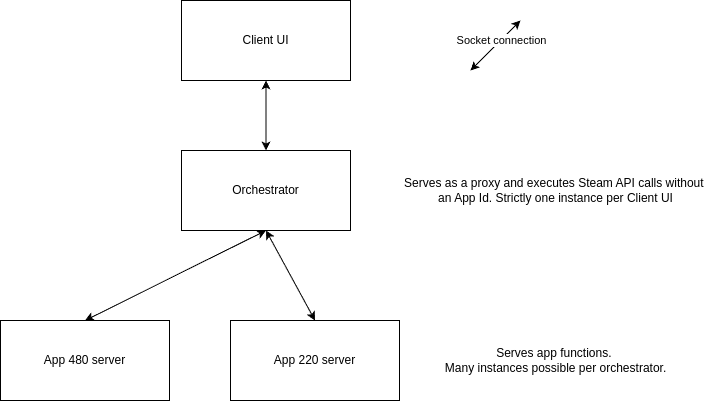

# SamRewritten Project Documentation

Welcome to the technical documentation for SamRewritten. This document provides an overview of the project's architecture, design decisions, and code organization.

## Architecture Overview

SamRewritten is designed with modularity and extensibility in mind. The orchestrator component can be reused for tasks such as farming account game time or card drops. Its modular design makes it easy to interface with from other Rust programs using Serde for serialization.

### Communication

- Inter-process communication is handled via pipes in a request-response pattern.
- JSON is used for message serialization for its human readability and ease of debugging, despite alternatives like `bincode` offering better performance. In practice, JSON has not been a significant bottleneck.

### Orchestrator Design

- The orchestrator does not execute game functions directly. This is intentional: Steam will continue to show you as "in game" as long as the started game process (or its zombie) is running. By separating orchestration from execution, the tool avoids this issue.

## Code Organization

- **backend**: Orchestrator and app servers
- **frontend**: Client UI
- **steam_client**: Steamworks SDK bindings, used by the backend
- **utils**: Shared utility functions, including file path helpers and IPC types

For more details, see the source code and module-level documentation.